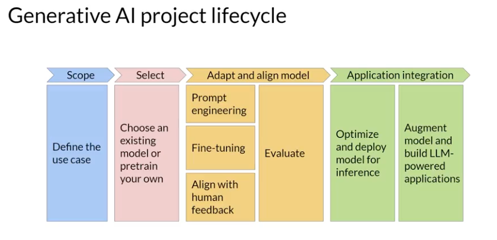

# 01. The LLM Project Lifecycle

[Contents](../README.md) | Next: [02. Transformers](02-transformers.md)

## The big picture

Generative AI produces new text, images, audio, or other content from learned patterns. This course focuses on large language models (LLMs), especially a recurring example: summarizing a dialogue. A model is only one part of a useful application. Before experimenting, decide what the output must do, how it will be evaluated, and what resources and risks are acceptable.

The lifecycle has four connected stages:

1. **Scope:** Specify the task, audience, data, constraints, and success criteria. For dialogue summarization, decide which facts must be retained and whether invented details are unacceptable.
2. **Select:** Start with an existing model and inspect its model card. Pre-training from scratch is an exceptional choice requiring extensive data and compute.
3. **Adapt, align, and evaluate:** Try prompts first, then fine-tuning if needed. Evaluate throughout, not just at the end. Human feedback can help shape behavior that simple task metrics miss.
4. **Integrate:** Serve the model behind an application, connect it to authorized information or tools when needed, and monitor quality, cost, latency, and safety.

These stages are iterative: an evaluation failure may send you back to improve the data, prompt, model, or task definition.

## The course's running example

- [Lab 1](05-lab-prompting.md) uses the DialogSum dataset and FLAN-T5 for summaries without changing model weights.
- [Lab 2](08-lab-fine-tuning.md) compares full fine-tuning and LoRA on summarization.
- [Lab 3](10-lab-rlhf.md) uses a toxicity reward and PPO to adjust a summarization-tuned model.

An application team might include a product owner defining success, data engineers preparing sources, ML engineers adapting/evaluating the model, and software engineers integrating it. The roles overlap; the task definition and evaluation need shared ownership.

**Checkpoint:** Write down one dialogue-summary requirement that ROUGE alone cannot verify. For example, a summary must not reverse who agreed to do a task.

Sources: [course introduction](../subtitles/subtitle%20%2800%29.txt), [capabilities](../subtitles/subtitle%20%28000%29.txt), [project lifecycle lecture](../subtitles/subtitle%20%285%29.txt). [Week 1 slides](../slides/Weel1.pdf) provide the original diagrams; use the image above for a quick visual refresher.