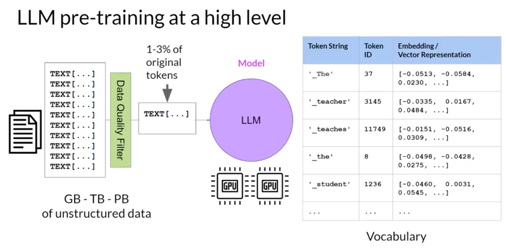
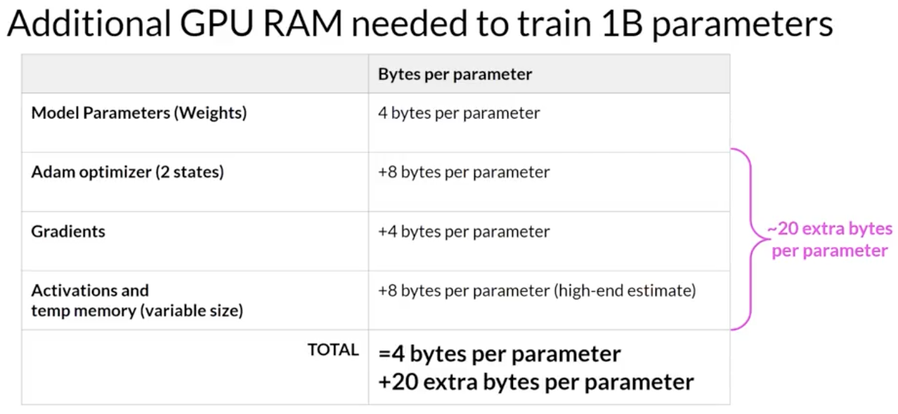
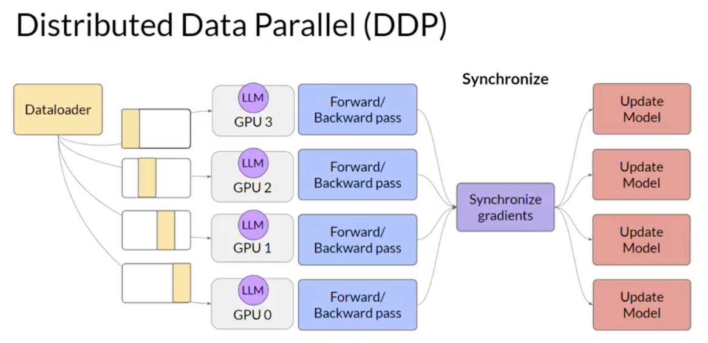
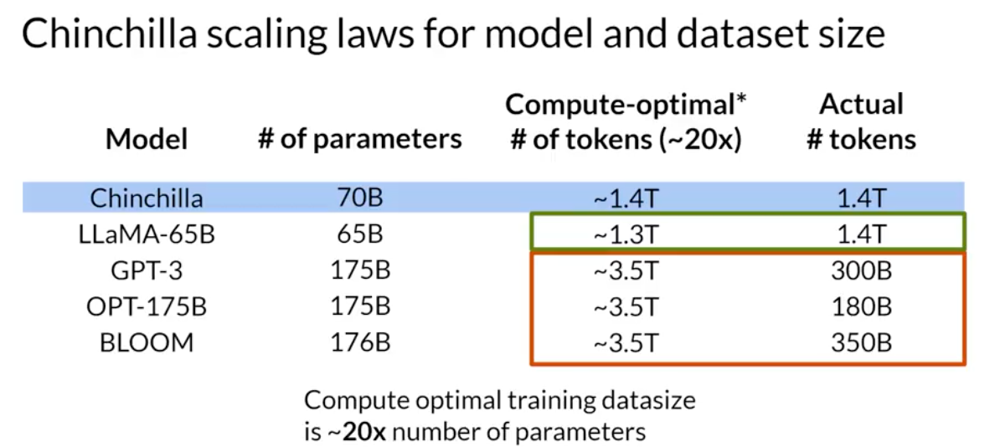

# 03. Pre-training, Model Selection, and Compute

[Previous: 02. Transformers](02-transformers.md) | [Contents](../README.md) | Next: [04. Prompting](04-prompting.md)

## From data to a foundation model

Pre-training learns general patterns from a large, quality-filtered text corpus. A tokenizer maps text to IDs; the chosen architecture's learning objective teaches the model to predict missing spans or future tokens. Training a general model from scratch requires substantial data, time, and hardware. A specialized domain with unfamiliar terminology may justify additional domain training, but adapting an existing model is usually the first experiment.

Choose a model by **task fit**, not only parameter count. A model card should state intended uses, limitations, training/evaluation information, license, and any access restrictions. Test the model on your own representative examples. The course labs choose instruction-tuned FLAN-T5 for text-to-text summarization. [Model selection lecture](../subtitles/subtitle%20%287%29.txt) and [domain pre-training lecture](../subtitles/subtitle%20%2810%29.txt) explain the trade-off.

## Memory and throughput

At FP32, one billion weights occupy roughly $10^9 \times 4$ bytes, or 4 GB in decimal units, just to store the weights. Training also needs gradients, optimizer states, and activations, whose sizes depend on the optimizer, precision, batch, and implementation. The often quoted ~24 GB for a one-billion-parameter training example is an illustrative estimate, **not** a guarantee that a model will fit.

Lower numerical precision can save memory: FP32 stores 32-bit floating-point values, FP16 and BF16 use 16 bits, while INT8 uses 8-bit integers plus scaling information in practical quantization schemes. BF16 has a wider exponent range than FP16 but less mantissa precision. Quantization can affect output quality and does not make every operation or training setup use one quarter the memory.

When using multiple GPUs, **DDP** replicates the model on each worker and synchronizes gradients after each worker sees different data. **FSDP** and ZeRO-style sharding split parameters, gradients, and/or optimizer states across workers, reducing memory per GPU at the cost of communication and complexity. More GPUs do not automatically make training efficient.

## Compute-optimal training

With a fixed compute budget, spending everything on model size can leave too few training tokens. The Chinchilla result argued for balancing parameter count and training tokens (roughly 20 tokens per parameter in its studied regime). It is a historical research finding, not a universal deployment formula.

**Checkpoint:** Why can a model fit for inference but fail to fit for full fine-tuning? When would DDP replication be insufficient? Which model-card details would you check before using FLAN-T5?

Sources: [GPU memory and precision](../subtitles/subtitle%20%288%29.txt), [scaling and compute](../subtitles/subtitle%20%289%29.txt); [Week 1 slides](../slides/Weel1.pdf). Model counts, GPU estimates, and leaderboards in course materials are historical.