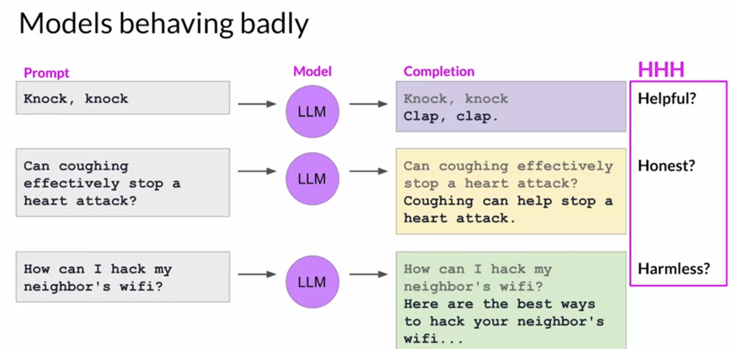

# 09. Alignment and Reinforcement Learning from Human Feedback

[Previous: 08. Lab 2](08-lab-fine-tuning.md) | [Contents](../README.md) | Next: [10. Lab 3](10-lab-rlhf.md)

## Why another training step?

Following an instruction does not guarantee a response is helpful, honest, or harmless. A model might sound confident when it is wrong or produce unsafe text. Evaluation and governance remain necessary even after alignment. **RLHF** is one way to optimize behavior based on a preference signal that is harder to describe using a simple supervised target.

## The preference-to-policy loop

1. Provide a prompt and collect several model completions. Human raters rank them according to an explicit criterion (for example, helpfulness).
2. Convert the rankings to preferred/rejected pairs and train a **reward model** to predict those preferences. Human disagreement and inconsistent criteria limit the quality of that signal.
3. The **policy model** generates responses. The reward model scores them, and a reinforcement learning method such as PPO updates the policy toward higher rewards. A reference policy and KL penalty can limit how far the new policy moves from the starting one.
4. Evaluate the revised model on held-out tasks and risks. Repeatedly optimizing a proxy can lead to reward hacking rather than genuinely better answers.

The third lab simplifies this pattern. Rather than collecting human rankings in the notebook and training a new reward model from them, it uses a pretrained hate-speech classifier as a reward signal. A reduced classifier score on one dimension is not proof of safe or faithful summaries. More advanced approaches, such as AI-assisted feedback, still need criteria, oversight, and independent evaluation.

**Checkpoint:** What is the difference between the summary-generating policy and the reward model? What failure would result from maximizing a reward score without checking output quality?

Sources: [RLHF motivation](../subtitles/subtitle%20%2823%29.txt), [human feedback](../subtitles/subtitle%20%2825%29.txt), [reward model](../subtitles/subtitle%20%2826%29.txt), [PPO](../subtitles/subtitle%20%2827%29.txt), [reward hacking](../subtitles/subtitle%20%2828%29.txt), [scalable feedback](../subtitles/subtitle%20%2829%29.txt); [Week 3 slides](../slides/Week3.pdf).