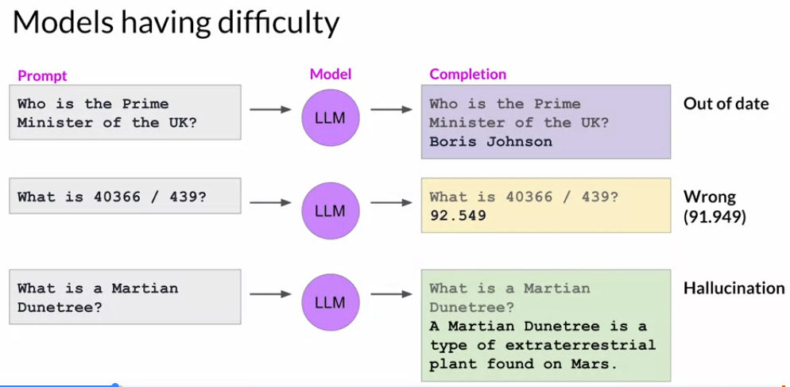
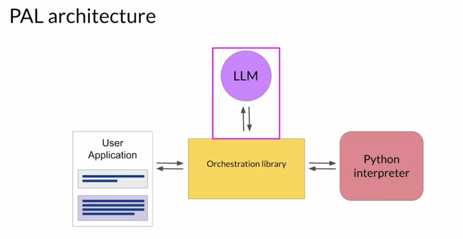

# 12. Build an LLM-powered Application

[Previous: 11. Optimization](11-optimization.md) | [Contents](../README.md) | [Quick reference](../quick-reference.md)

## Match the intervention to the failure

An LLM can produce outdated answers, fail at arithmetic, or invent plausible-sounding facts. Changing prompts or fine-tuning is not always the right remedy. Use **retrieval** for information that changes or is private, a **code interpreter** for exact calculations, and independent checks for facts and safety.

In retrieval-augmented generation (**RAG**), a retriever selects relevant passages from authorized documents and passes them as context to the model. For a question about employee parking, retrieve the current parking policy, then ask the model to answer using that passage and cite it. Retrieval quality and document trust matter: a retrieved page can be irrelevant, outdated, or contain instructions the application must not obey.

## Tools and orchestration

Examples showing intermediate reasoning steps can improve some tasks, but generated reasoning may still be wrong. **PAL** asks a model to produce a program and uses an interpreter to compute the result; validate or sandbox any generated code. **ReAct-style** workflows interleave reasoning with allowed actions and observations, such as searching a source before answering. An orchestrator coordinates the model, retrieval, tools, and application interface; frameworks such as LangChain are optional implementations, not prerequisites.

## End-to-end exercise

Design a dialogue-summary service: define required facts and prohibited disclosures; use the [Lab 1](05-lab-prompting.md) prompted baseline; compare [Lab 2](08-lab-fine-tuning.md) tuned models on held-out dialogues; assess risks using [Lab 3](10-lab-rlhf.md) as one illustrative signal. Add retrieval only if external policies are needed. Test prompt injection in retrieved text, wrong or missing facts, refusal behavior, latency, and cost before launch. Monitor after deployment because users and sources change.

**Checkpoint:** For a current HR policy question, would you choose RAG or task fine-tuning first? For an invoice calculation, what should the model do before answering? What should be logged or reviewed after deployment?

Sources: [model limitations](../subtitles/subtitle%20%2833%29.txt), [RAG](../subtitles/subtitle%20%2834%29.txt), [reasoning examples](../subtitles/subtitle%20%2835%29.txt), [PAL](../subtitles/subtitle%20%2836%29.txt), [ReAct](../subtitles/subtitle%20%2837%29.txt), [application stack](../subtitles/subtitle%20%2838%29.txt), [responsible AI](../subtitles/subtitle%20%2839%29.txt), [closing](../subtitles/subtitle%20%2840%29.txt); [Week 3 slides](../slides/Week3.pdf).