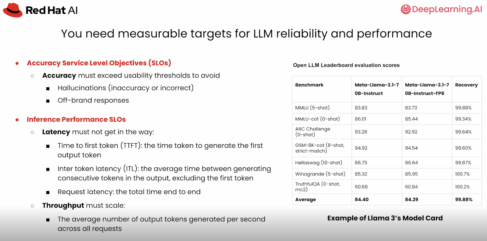
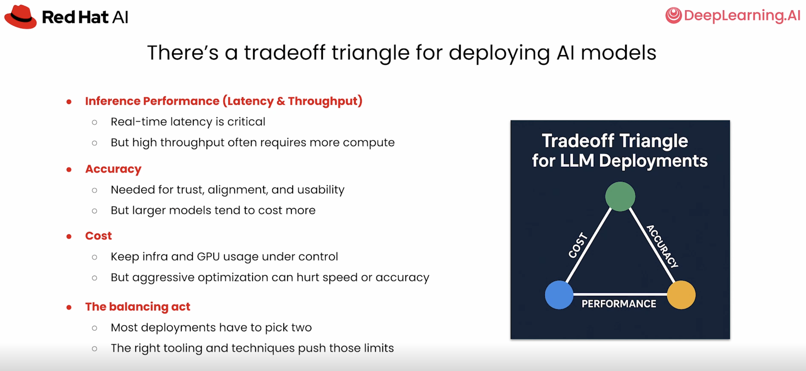
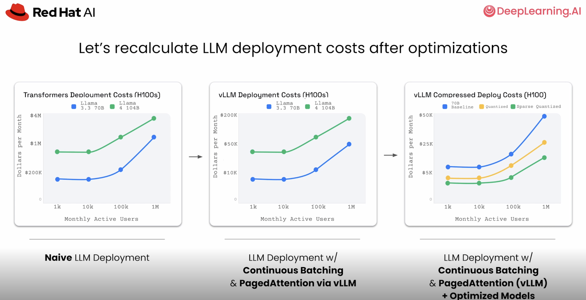

# Chapter 1 - Why Efficient LLM Deployment Matters

## Purpose

Establish the business and engineering motivation for efficient inference.

Source transcript: [Why efficient LLM deployment matters](../../transcripts/01-foundations/01-why-efficient-llm-deployment-matters.md)

## Learning Objectives

- Explain why inference cost can dominate after training.
- Identify the reasons to self-host: cost savings, security, control, and customization.
- Distinguish model optimization from inference optimization.
- Define accuracy and performance SLOs for a deployment.

## Core Concepts

- Accuracy must exceed a use-case-specific usability threshold.
- Key performance metrics are TTFT, ITL, end-to-end latency, and throughput.
- GPU memory holds fixed model weights and growing per-request KV cache.
- Deployment balances accuracy, performance, and cost.

## Visual References

## Reference Example

A 70B model in BF16 requires about 140 GB for weights. A 32K-token request can require roughly 10 GB of KV cache, so fitting the weights does not guarantee useful concurrency.

## Practice

- Inspect a model card and identify its quality benchmarks.
- Write accuracy and latency SLOs for an e-commerce chatbot and a RAG application.
- Classify optimizations as pre-deployment or runtime techniques.

## Checkpoint

Explain why an accurate model may still be unusable in production.

Next: [Inference Memory Fundamentals](02-inference-memory.md)