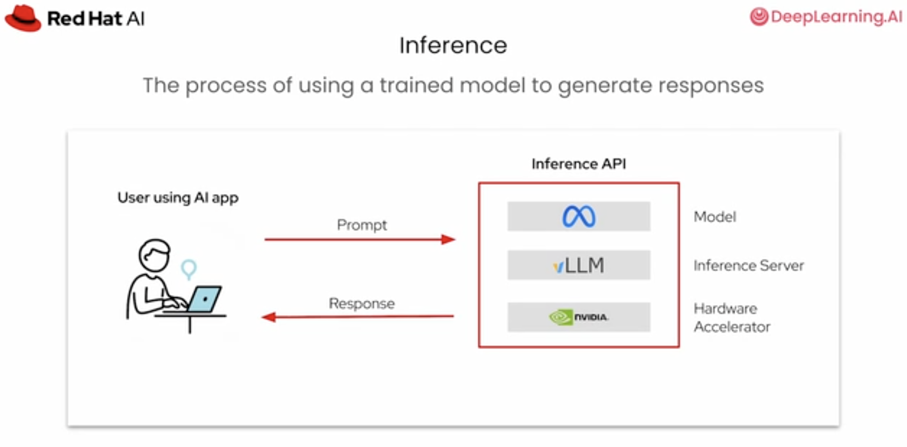
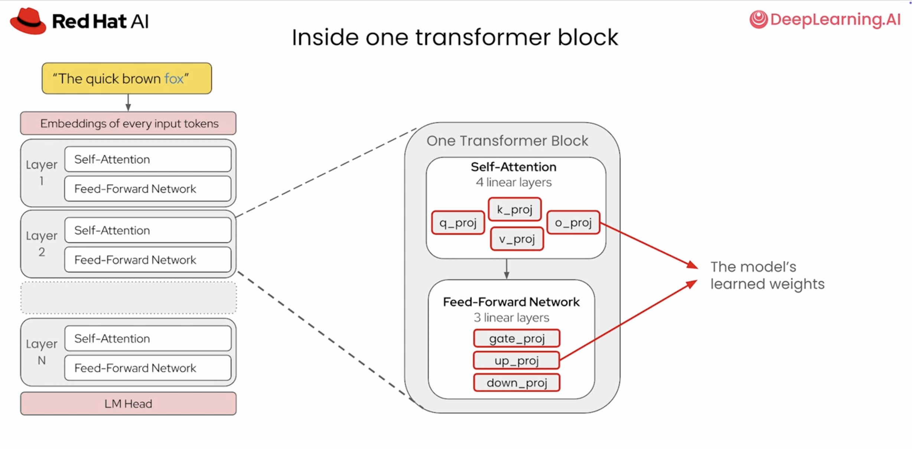
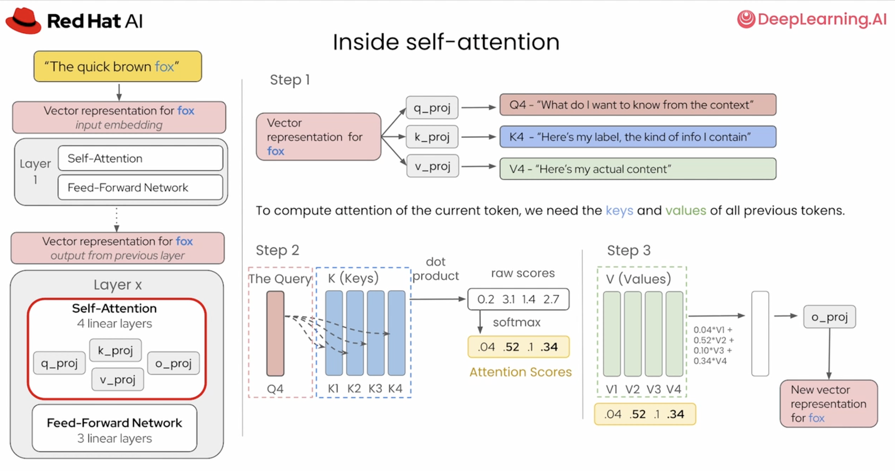
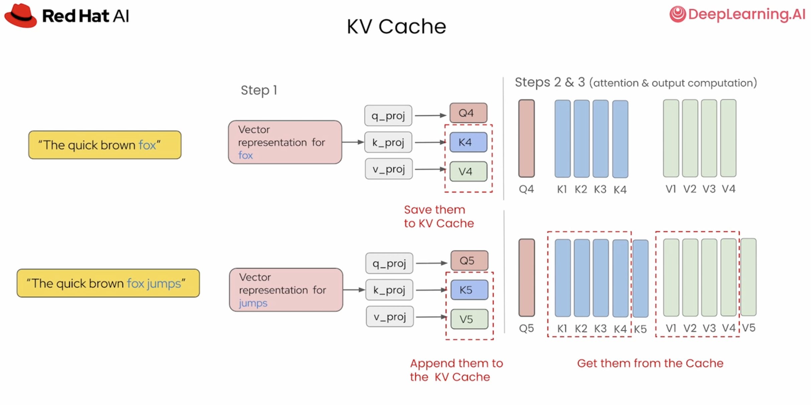
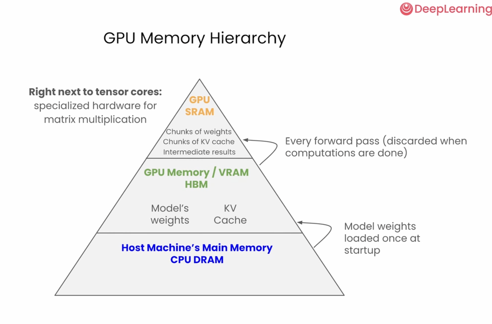
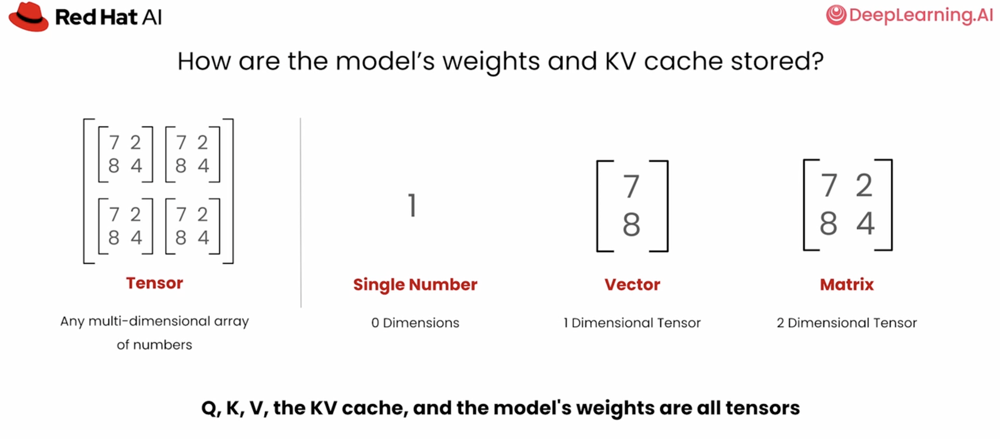
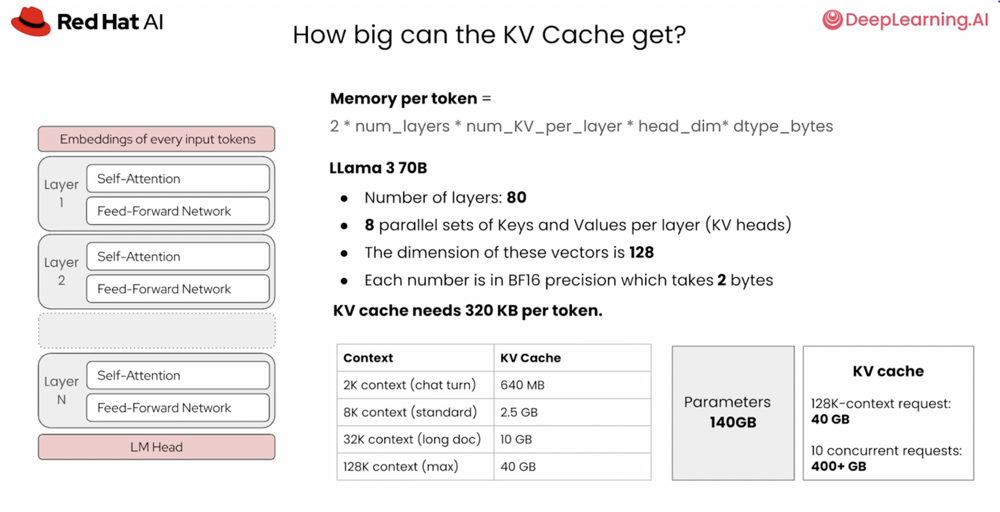

# Chapter 2 - Inference Memory Fundamentals

## Purpose

Understand token generation and the memory hierarchy that controls inference.

Source transcript: [Inference memory fundamentals](../../transcripts/01-foundations/02-inference-memory-fundamentals.md)

## Learning Objectives

- Trace a prompt through the model, inference server, and accelerator.
- Explain autoregressive generation and repeated forward passes.
- Describe transformer blocks, attention, and linear layers.
- Calculate KV-cache memory for a model and context length.

## Core Concepts

- A transformer block contains self-attention and a feed-forward network.
- Attention compares the current query with historical keys, then combines values.
- Model weights remain in GPU HBM for the server lifetime.
- KV entries are retained for active request tokens.
- Data moves from CPU DRAM to GPU HBM to GPU SRAM and tensor cores.

## Visual References















## Key Formula

```text
KV bytes per token =
  2 * number of layers * KV heads * head dimension * bytes per value
```

For the Llama 3 70B example, this is about 320 KB per token, or 10 GB for 32K tokens.

## Practice

- Calculate cache size for 2K, 8K, 32K, and 128K contexts.
- Repeat the calculation for multiple concurrent requests.
- Identify whether a workload is likely compute-bound or memory-bound.

## Checkpoint

Explain why KV-cache capacity limits concurrency even when model weights fit.

Next: [Phase 2 - Model Optimization](../02-model-optimization/README.md)