# Chapter 1 - LLM Optimization Fundamentals

## Purpose

Learn how lower-precision representations reduce model size and data movement.

Source transcript: [LLM optimization fundamentals](transcript.md)

## Learning Objectives

- Compare BF16, FP16, FP8, INT8, and INT4.
- Distinguish weight-only from weight-and-activation quantization.
- Explain sparsification and the 2:4 pattern.
- Predict memory savings and quality risk.

## Core Concepts

- INT8 provides roughly 50% weight-storage reduction versus two-byte BF16.
- INT4 provides roughly 75% reduction before metadata and unquantized layers.
- W8A16 reduces weight movement while retaining high-precision activation computation.
- W8A8 can also use lower-precision tensor cores when hardware supports it.
- Calibration is important because naive rounding can damage INT4 quality.

## Visual References

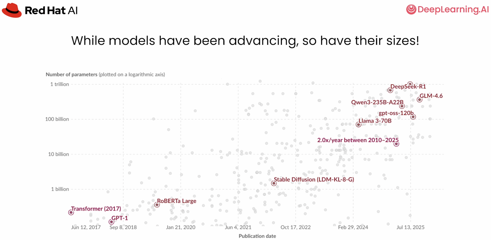

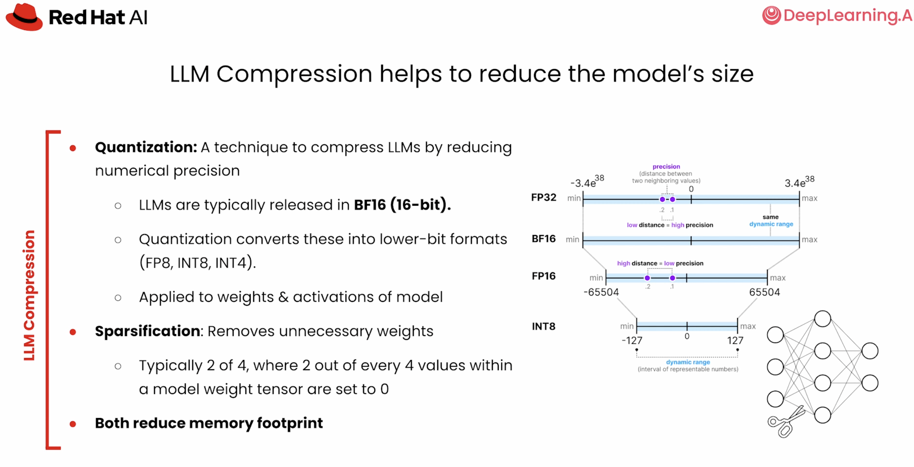

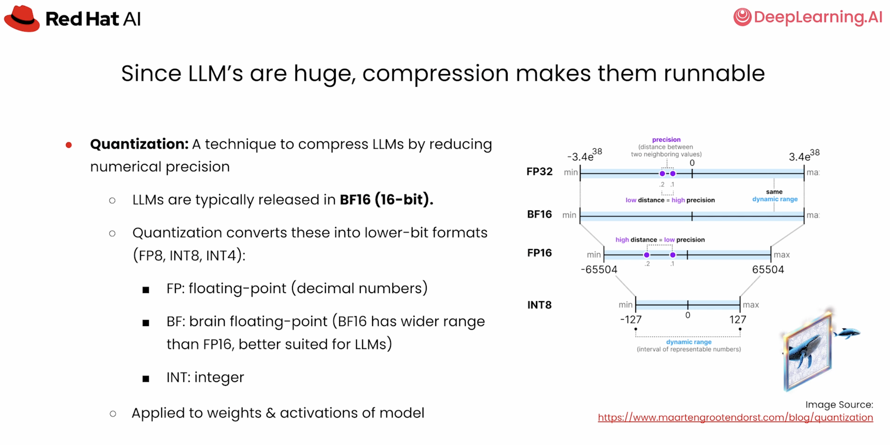

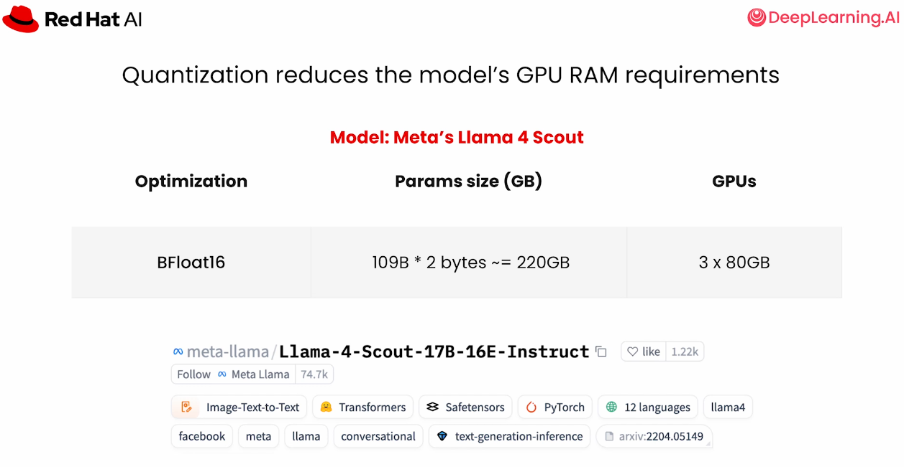

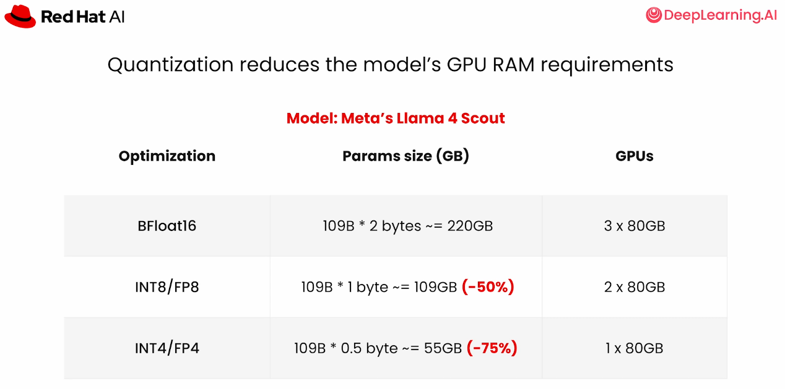

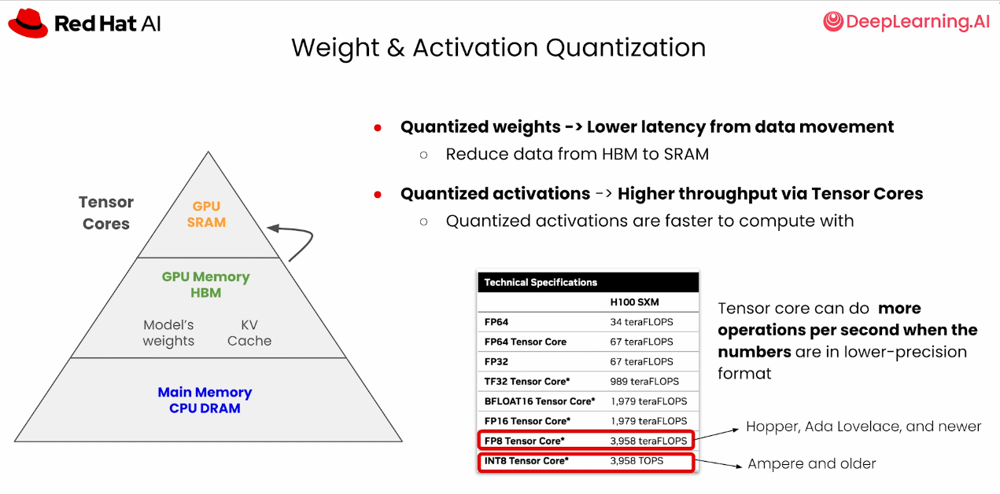

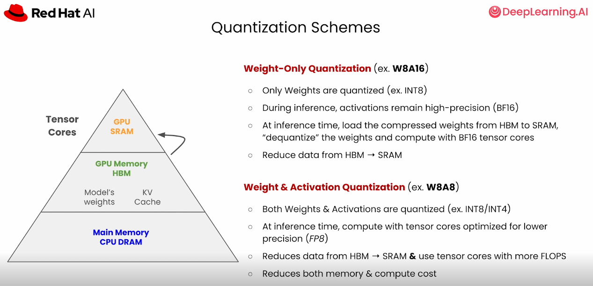

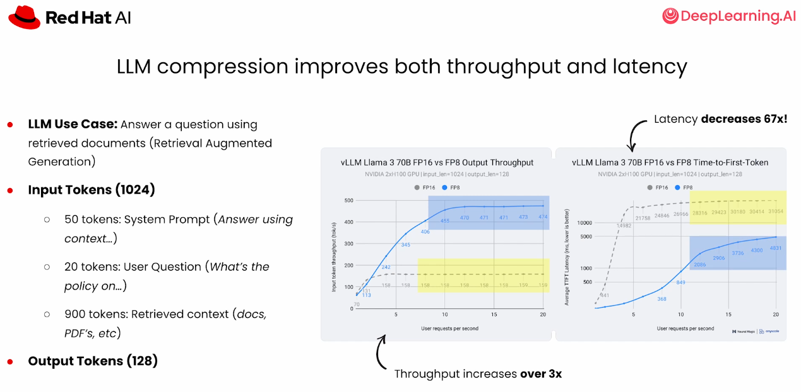

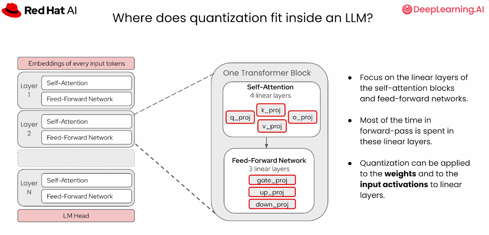

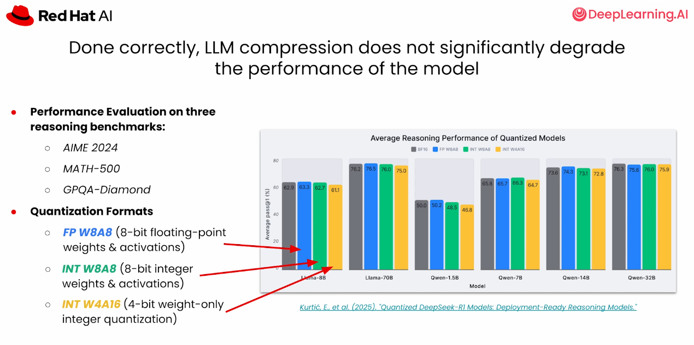

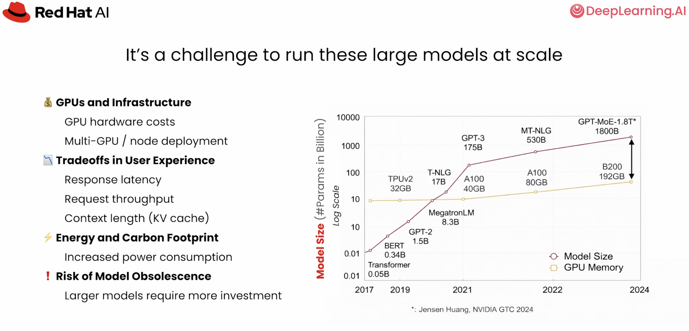

## Algorithm Selection

| Method | Strength | Tradeoff |
| --- | --- | --- |
| Round-to-nearest | Fast baseline | Quality can degrade at low bit widths |
| AWQ | Accuracy and speed balance | Requires calibration and is hardware-sensitive |
| GPTQ | Strong recovery and broad adoption | More expensive compression step |
| Sparsification | Can reduce compute | Requires compatible hardware and kernels |

## Practice

- Estimate GPU count for BF16, INT8, and INT4 versions of a model.
- Compare published benchmark recovery values.
- Explain why weight-only quantization can improve latency without reducing arithmetic precision.

## Checkpoint

Choose a format based on hardware support, memory pressure, latency goals, and acceptable quality loss.

Next: [LLM Compressor Lab](../02-llm-compressor-lab/README.md)