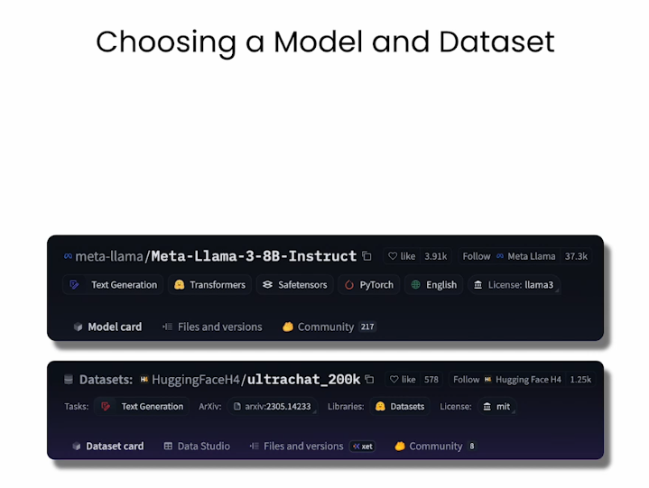
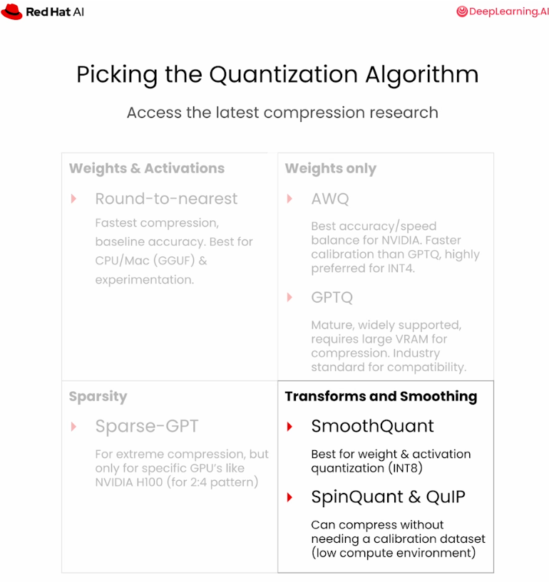
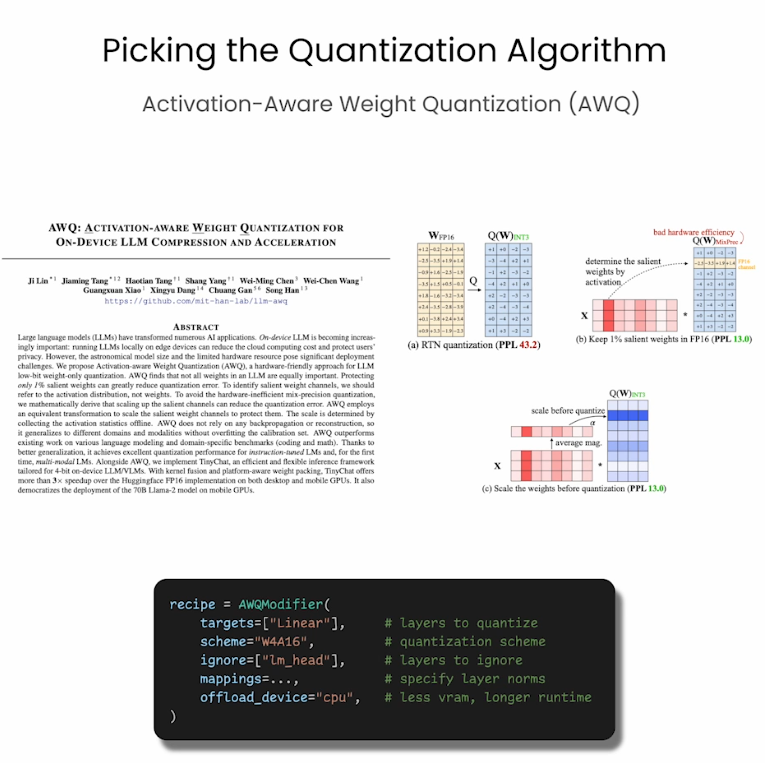
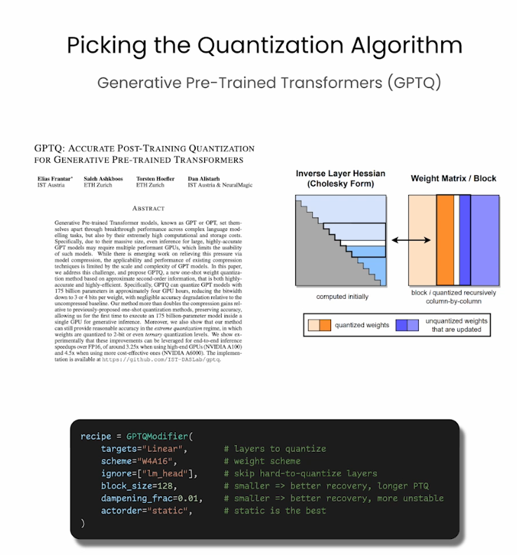
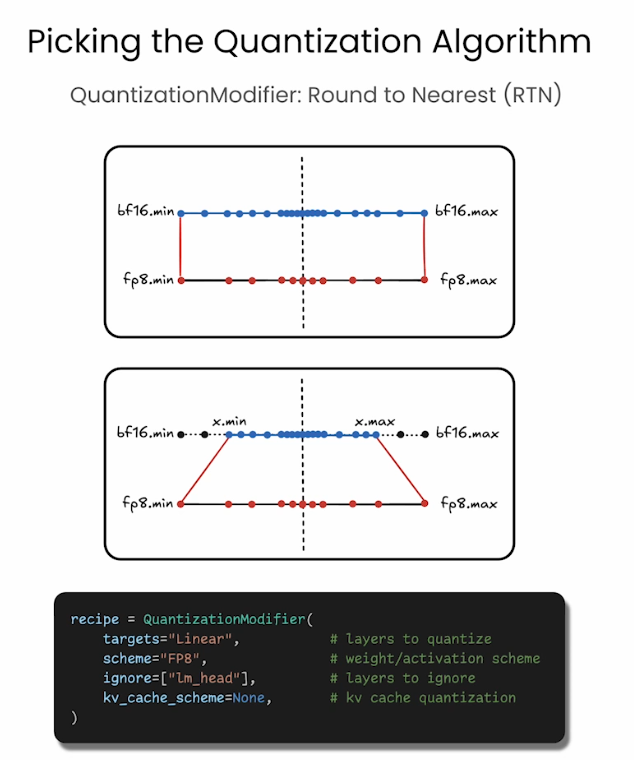
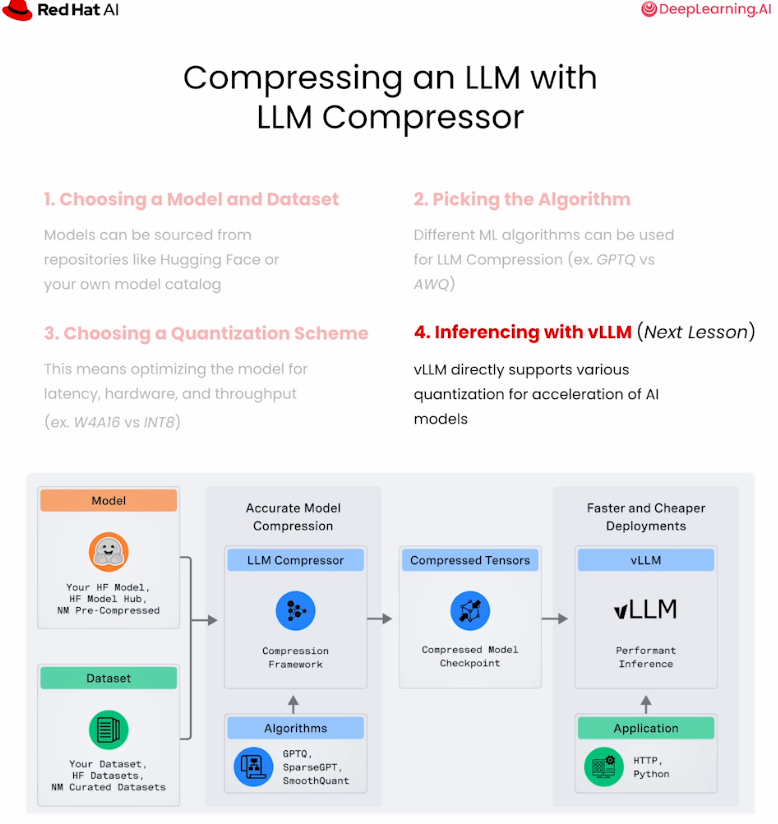

# Chapter 2 - LLM Compressor Lab

## Purpose

Compress a model and validate the result instead of trusting theoretical bit reduction.

Source transcript: [LLM Compressor lab](../../transcripts/02-model-optimization/02-llm-compressor-lab.md)

## Notebook

Work through the [LLM Compressor lab notebook](02-llm-compressor-lab.ipynb).

## Visual References

## Workflow

1. Choose a model and representative calibration dataset.
2. Choose GPTQ, AWQ, or another supported algorithm.
3. Choose a scheme such as W4A16.
4. Compress and save a new checkpoint.
5. Run inference with the compressed checkpoint.
6. Compare size, perplexity, and task quality with the original.

## Important Parameters

- `num_calibration_samples`: More samples improve calibration but increase runtime.
- `max_seq_length`: Reflect the context lengths used in production.
- `targets`: Select the linear layers to quantize.
- `ignore`: Keep sensitive modules such as `lm_head` at higher precision when needed.

## Quality Validation

Perplexity measures how surprised the model is by held-out text; lower is better. Use held-out data and a sliding window for long sequences. Pair perplexity with task-specific evaluation before making a release decision.

## Practice

- Compress the lab model using W4A16.
- Generate the same prompts with original and compressed models.
- Record checkpoint size and perplexity delta.
- Document whether the quality change is acceptable.

## Checkpoint

Produce a compressed checkpoint and defend its use with measurements.

Next: [Phase 3 - Inference Optimization](../03-inference-optimization/README.md)