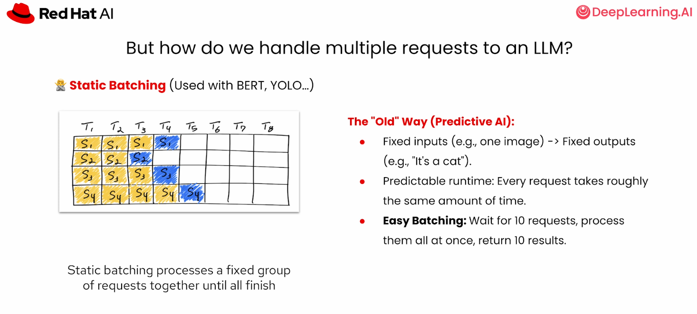
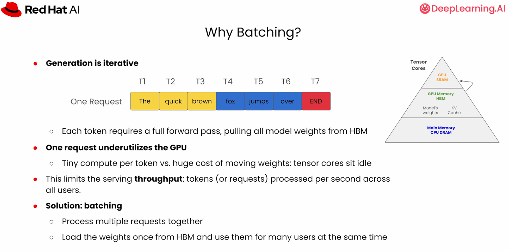
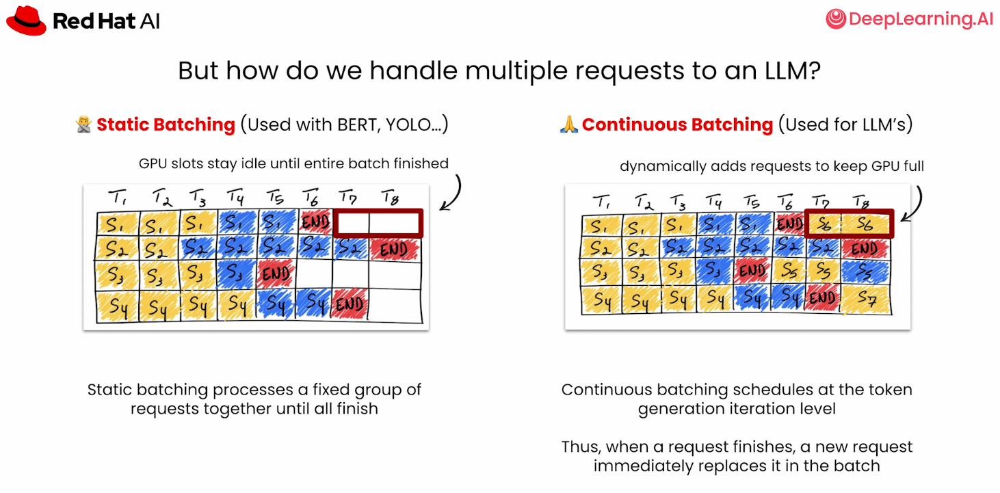
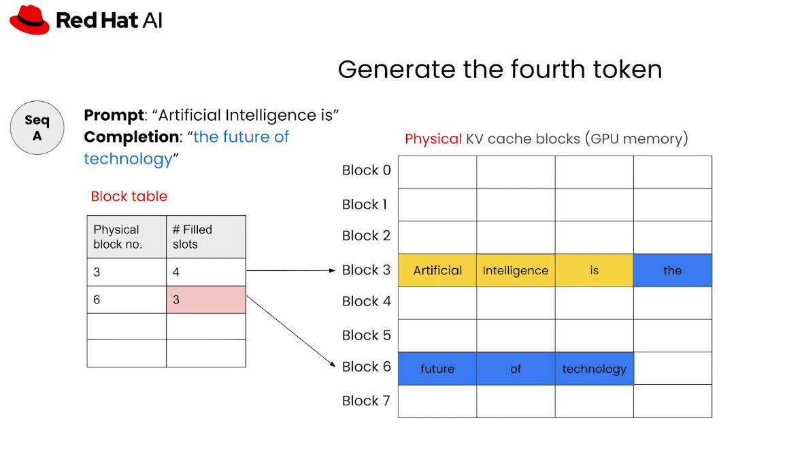
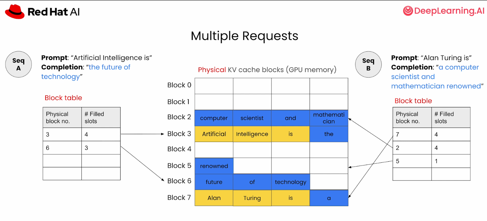
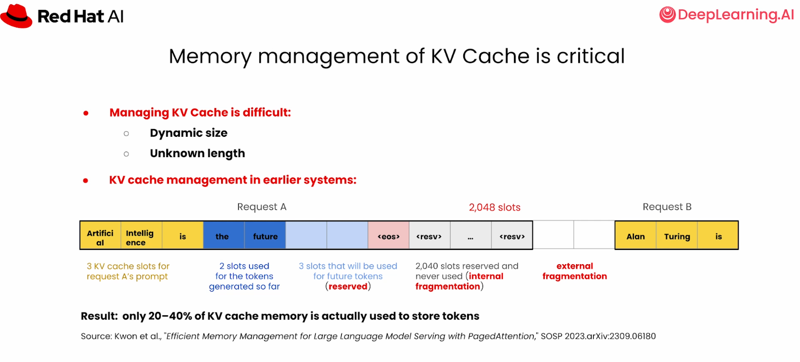
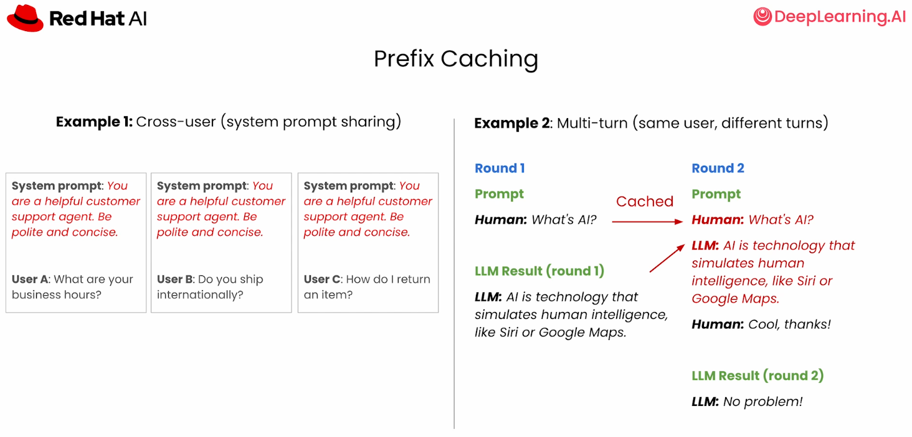
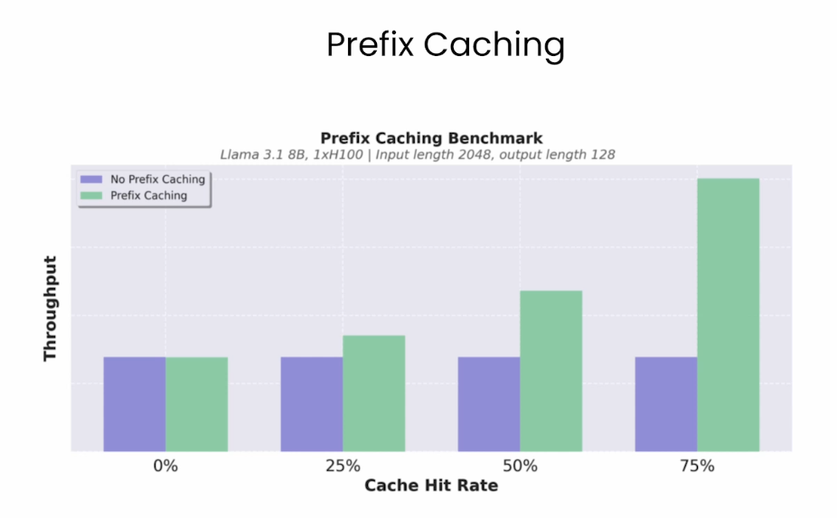

# Chapter 1 - Serving LLMs Efficiently with vLLM

## Purpose

Understand how an inference engine improves utilization without changing model weights.

Source transcript: [Serving LLMs efficiently with vLLM](../../transcripts/03-inference-optimization/01-serving-llms-efficiently-with-vllm.md)

## Learning Objectives

- Explain why static batching wastes capacity for variable-length generation.
- Describe continuous batching at token-generation level.
- Explain how PagedAttention removes KV-cache fragmentation.
- Identify workloads that benefit from prefix caching.

## Core Concepts

- Static batching waits for every request, leaving finished slots idle.
- Continuous batching admits and removes requests during generation.
- PagedAttention stores KV cache in fixed-size blocks placed anywhere in GPU memory.
- A block table maps logical request tokens to physical KV blocks.
- Prefix caching reuses KV blocks for shared prompts and earlier conversation turns.

## Visual References

## Practice

- Draw two requests under static and continuous batching.
- Explain internal fragmentation, external fragmentation, and over-reservation.
- Identify an application with a high prefix-cache hit rate.

## Checkpoint

Explain why vLLM can serve more requests on the same hardware without changing the model.

Next: [vLLM Lab](02-vllm-lab.md)