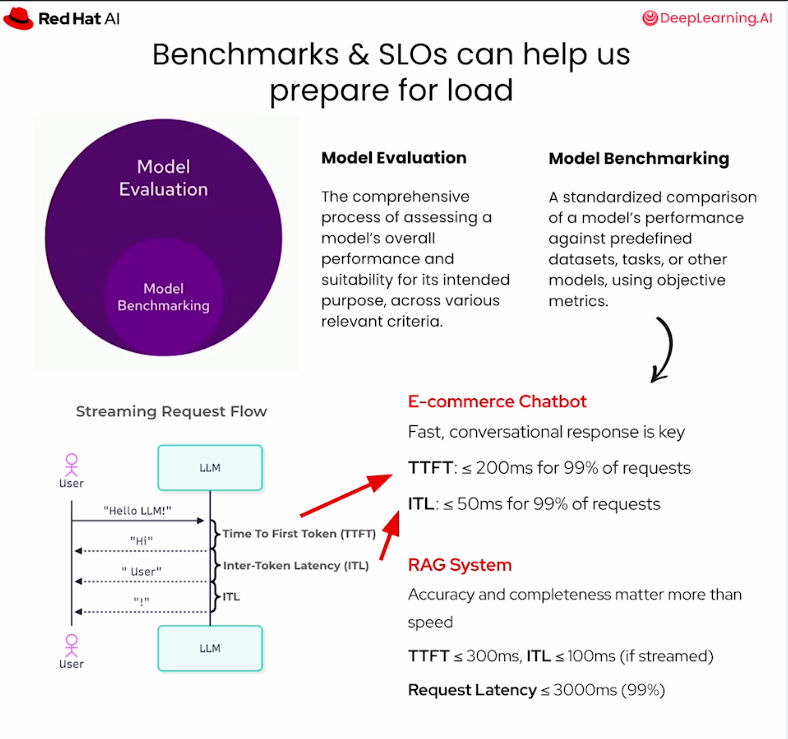
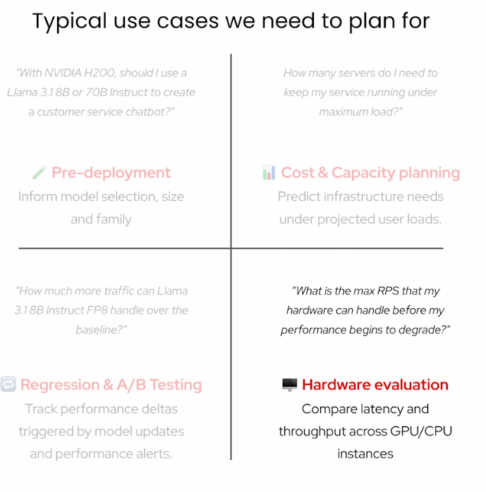
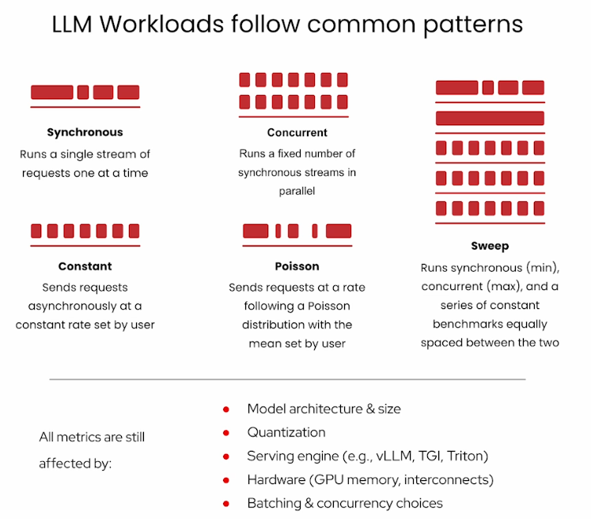
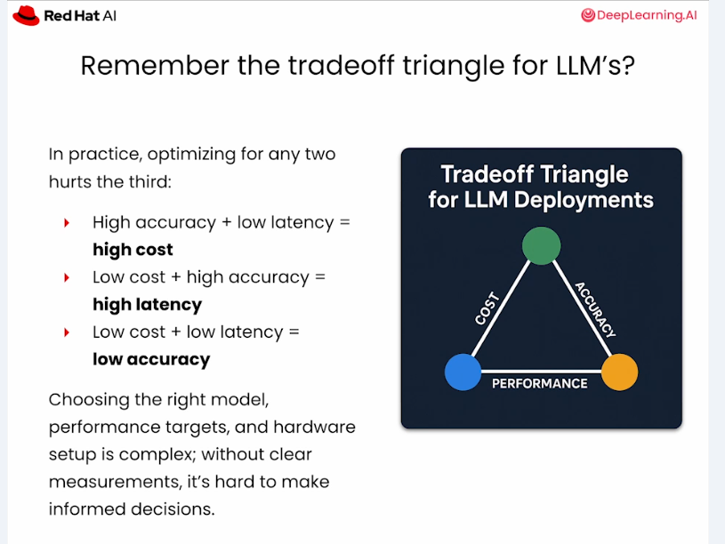

# Chapter 1 - Evaluation and Benchmarking

## Purpose

Measure deployment performance and model quality together.

Source transcript: [Evaluation lab](transcript.md) and [references](references.md)

## Notebook

Work through the [evaluation lab notebook](lab.ipynb).

## Learning Objectives

- Define SLOs before benchmarking.
- Measure streaming-aware latency with GuideLLM.
- Evaluate quality with `lm_eval`.
- Interpret p50, p95, and p99 instead of averages alone.
- Decide whether an optimized model is ready for a workload.

## Example SLOs

| Workload | TTFT | ITL | End-to-end |
| --- | ---: | ---: | ---: |
| E-commerce chatbot | <= 200 ms at p99 | <= 50 ms at p99 | Use case dependent |
| RAG system | <= 300 ms at p99 | <= 100 ms at p99 | <= 3 s |

These are examples. Define targets from the user experience and business requirements.

## Visual References









## Benchmark Dimensions

- Synchronous: single-request baseline.
- Concurrent: fixed parallel streams.
- Constant: steady request rate.
- Poisson: randomized arrivals around a mean rate.
- Sweep: increasing load used to find the capacity knee.

## Starter Benchmark

```bash
guidellm profile \
  --target http://localhost:8000/v1 \
  --profile synchronous \
  --max-requests 10 \
  --prompt-tokens 32 \
  --generation-tokens 16 \
  --num-samples 32 \
  --output-dir ./results
```

## Practice

- Benchmark the uncompressed model.
- Repeat with the compressed model.
- Run a small quality evaluation, then expand it for release.
- Record TTFT, ITL, end-to-end latency, throughput, GPU memory, KV-cache utilization, and accuracy.
- Write a go/no-go report with evidence and remaining risks.

## Evidence Stack

```text
Model card / lm_eval -> Does the model answer well?
GuideLLM             -> Does the service meet latency and throughput SLOs?
GPU and vLLM metrics -> Where is memory or scheduling pressure coming from?
```

## Checkpoint

Make a deployment recommendation that accounts for user experience and model quality.

Next: [Course catalog](../../../README.md)