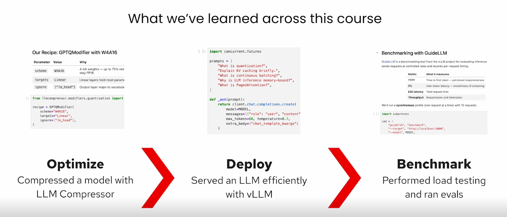
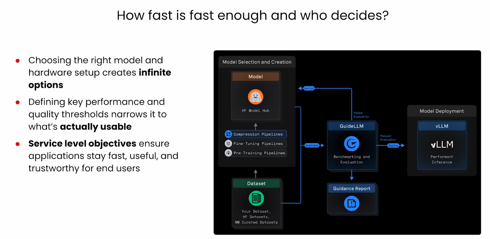
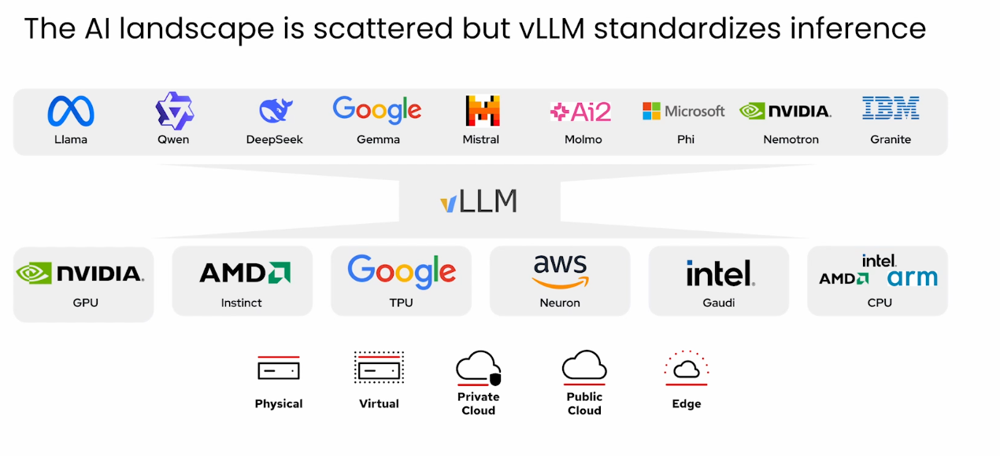
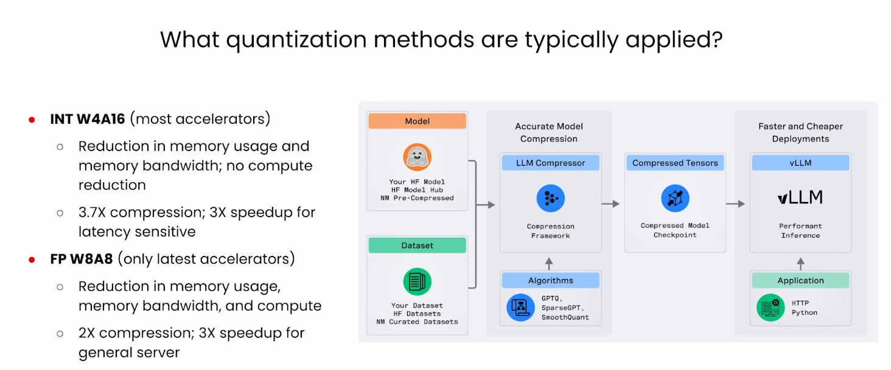

# Phase 5 - Course Summary

## Outcome

Connect model optimization, inference serving, and benchmarking into one deployment decision.

## The Operational Path

```text
Optimize -> Deploy -> Benchmark
```

1. Compress a model with an appropriate quantization strategy.
2. Serve it efficiently with vLLM and runtime optimizations.
3. Benchmark performance and evaluate quality against explicit SLOs.

## Key Decisions

- Select the model and hardware together.
- Define quality and performance thresholds before measuring.
- Treat accuracy, latency, throughput, and cost as a connected trade-off.
- Use benchmark evidence to decide whether a deployment is usable.

## Visual Summary









## Final Checkpoint

Write a deployment recommendation that names the selected model, precision, serving configuration, target hardware, measured SLOs, quality evidence, and remaining risks.

Next: [Course catalog](../../README.md)