# LLM Application

## Optimizing the llm

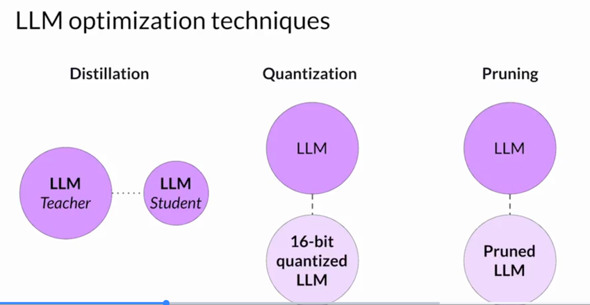

## Distilation

- using second model for inferenceing
- do not reduce the model size
- Suitable for encoder models only.

## Quantization

- reduce the memory
- small percentage reduction in model evaluation but saves cost

## Pruning

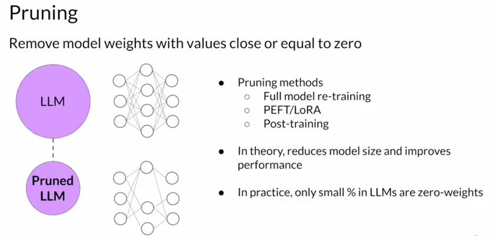

- eliminating weights that are not contributing much to overall model performance

## Time Lifecycle

Time and effort required in the inference lifecycle.

This is not applicable for the pre trained model as it is.

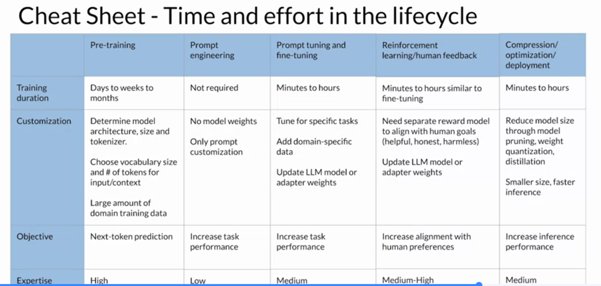

## Model problems

models have knowlegde of a specific dates any events after that date is unknow to the model.

solution:  external data source (RAG)

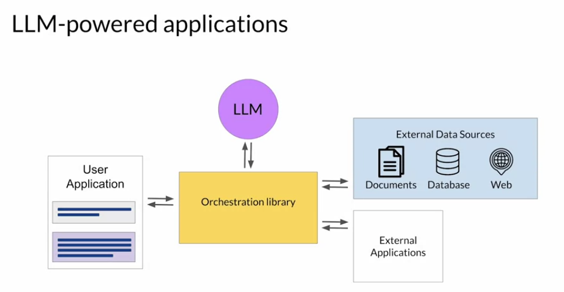

## LLM Reason - Chain of thoughts prompting

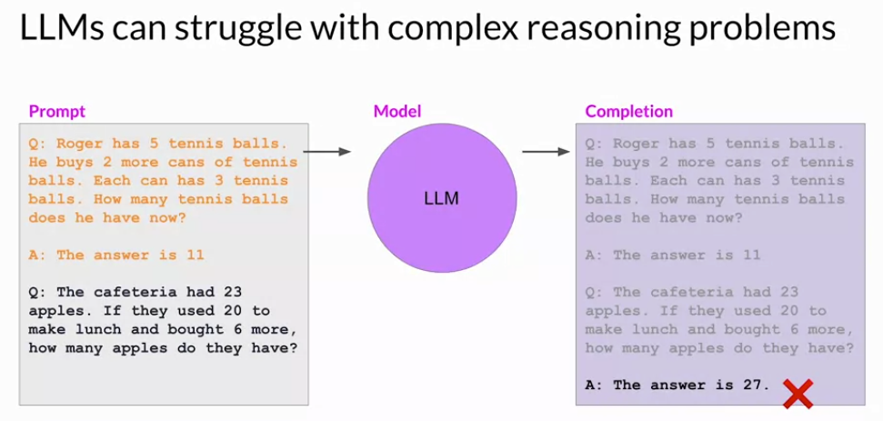

Solution: instruct llm to think like human steps by step ins

One strategy that has demonstrated some success is prompting the model to think more like a human, by breaking the problem down into steps. What do I mean by thinking more like a human?

These intermediate calculations form the reasoning steps that a human might take, and the full sequence of steps illustrates the chain of thought that went into solving the problem. Asking the model to mimic this behavior is known as chain of thought prompting. It works by including a series of intermediate reasoning steps into any examples that you use for one or few-shot inference.

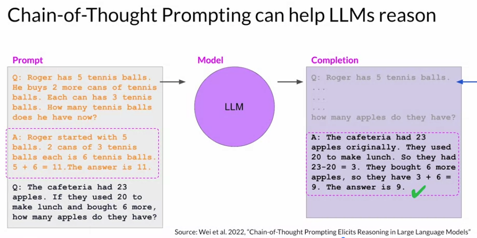

this is below example the density of is determined from the llm knowledge (not pass in prompt any where).

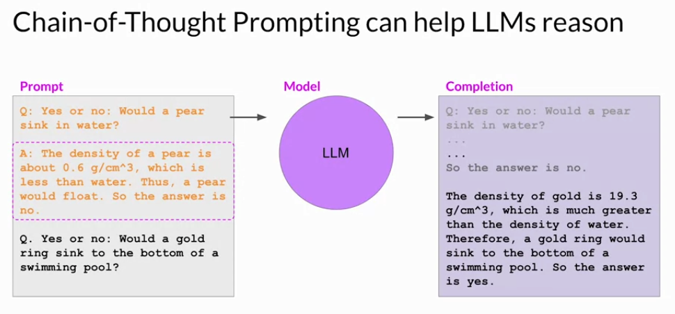

## Program aided language models (PAL)

LLMs are not good at math, it just try to predict next word and it will predict wrong with large calcuations.

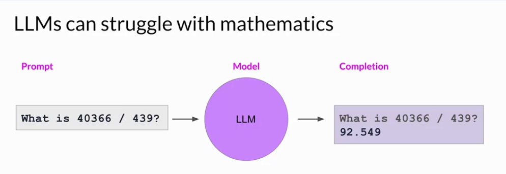

solution : program aided language.  pair the code interpreter (python) with the llm

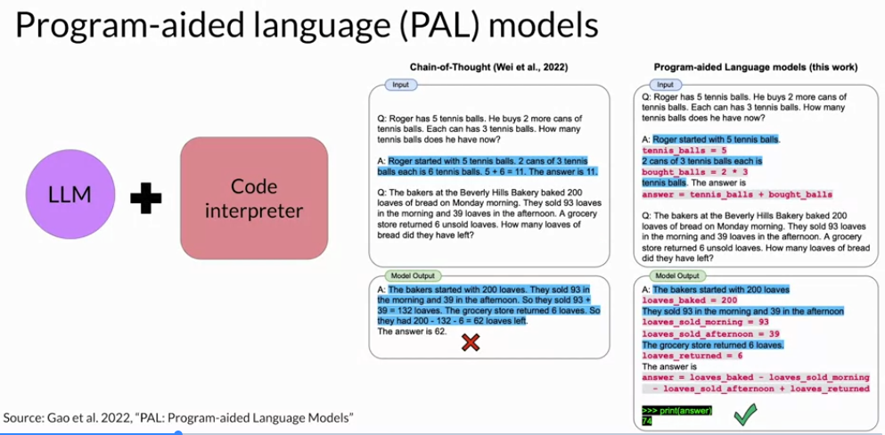

blue are comments, pink are python code.

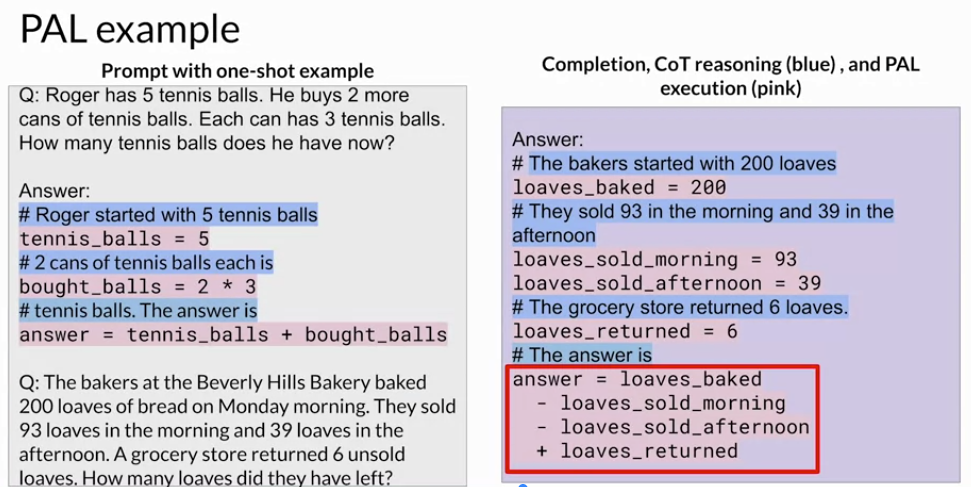

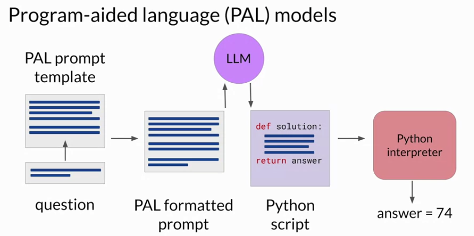

where it fits in the design?

The orchestrator shown here as the yellow box is a technical component that can manage the flow of information and the initiation of calls to external data sources or applications. It can also decide what actions to take based on the information contained in the output of the LLM

In PAL there's only one action to be carried out, the execution of Python code. The LLM doesn't really have to decide to run the code, it just has to write the script which the orchestrator then passes to the external interpreter to run

## ReAct - combining reasoning and action

ReAct that can ​help LLMs plan out and execute these workflows. ​ReAct is a prompting strategy that combines chain of thought reasoning ​with action planning.

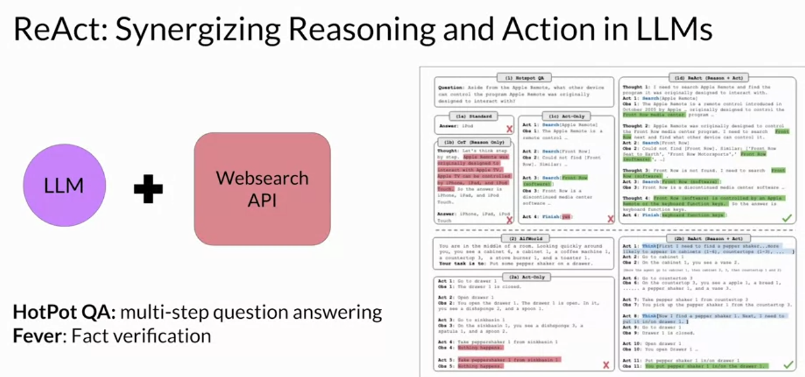

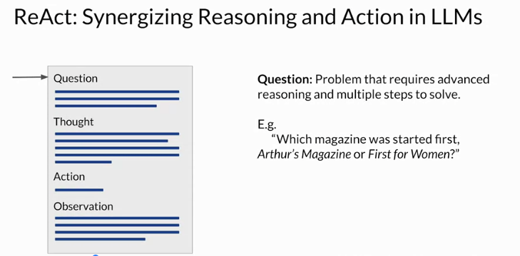

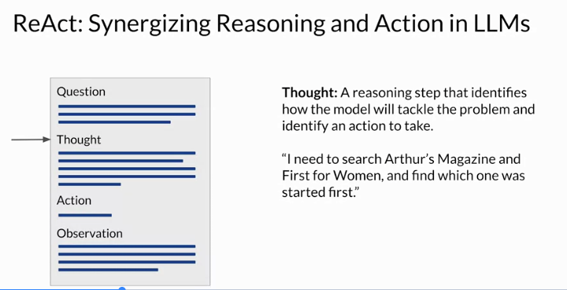

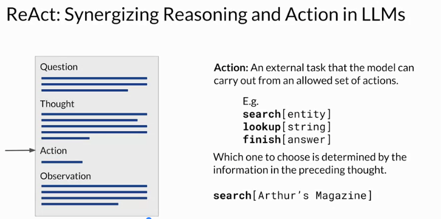

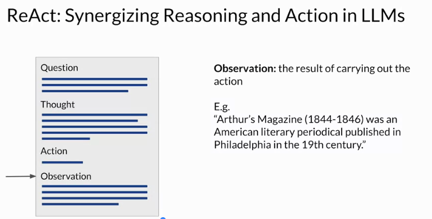

then it goes in cycle to complete the  action.

## Lang chain

Lang chain provides the predefined template for PAL, ReAct and more.

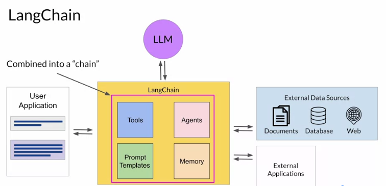

## Infra

- infrastructure (compute, storage, n/w)
- LLM models - foundation models or fine-tuned
- information sources (doc, db, web)
- generated output (store the completions, feedback for fine-tuning)
- llm tools & framework - langchain, model hub
- application interface - website, api
- consumer

