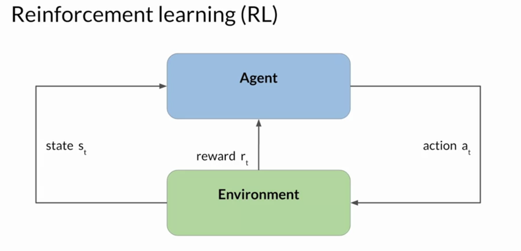
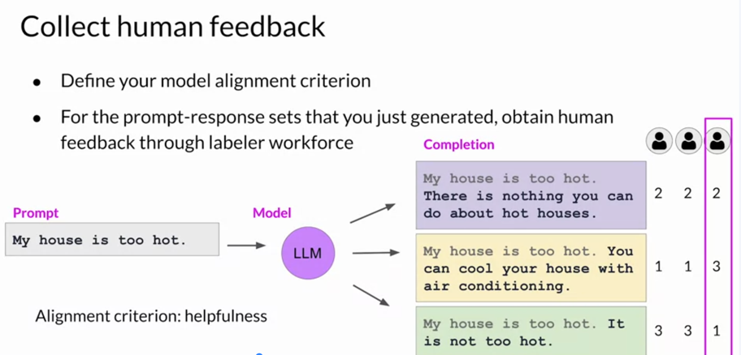
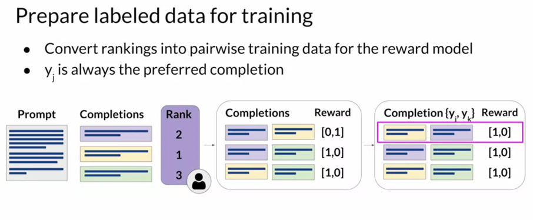
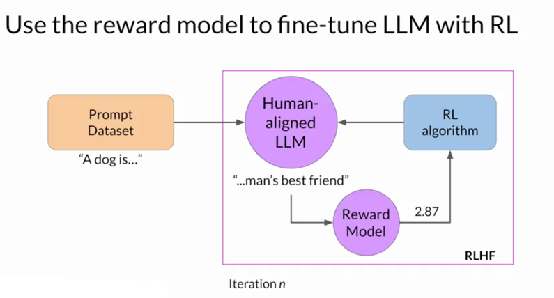

# RLHF (Reinforcement learning from human feedback)

Lab: [README.md](../projects/rlhf/README.md)

## Bad Response

HHH - helpful, honest, harmless

## Reinforcement learning

the agent continually learns from its experiences by taking actions, observing the resulting changes in the environment, and receiving rewards or penalties, based on the outcomes of its actions

## Human feedback

## Reward model

A popular choice for RL algorithm is proximal policy optimization or PPO for short