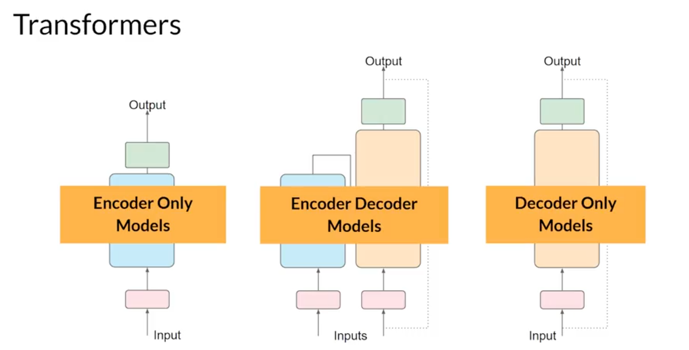
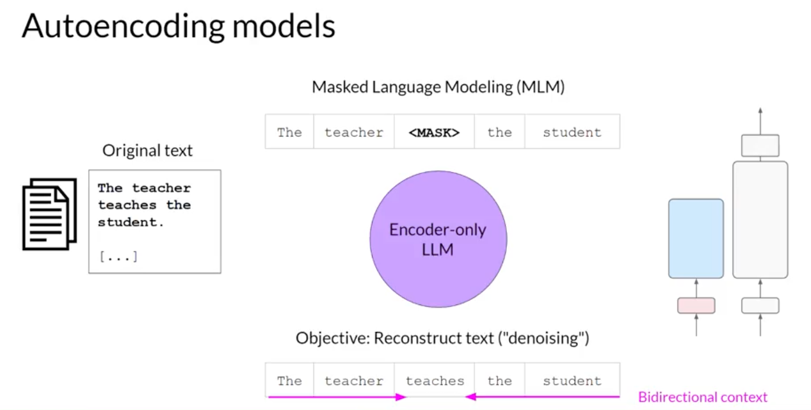
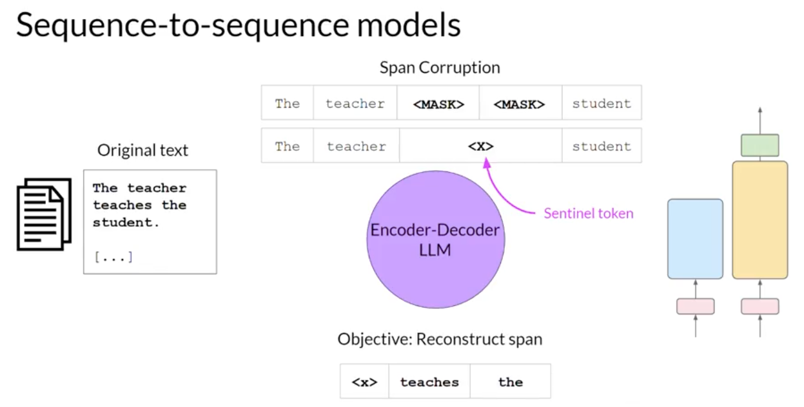
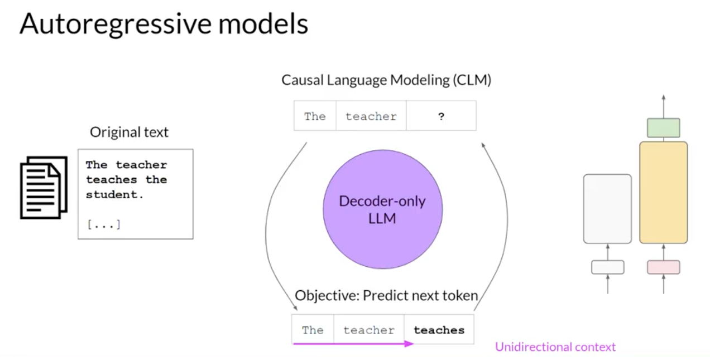

# Chapter 2 - Tokens, Transformers, and Model Families

[Previous: Chapter 1: Lifecycle](../01-project-lifecycle/README.md) | [Contents](../../../README.md) | Next: [Chapter 3: Pre-training](../03-pretraining-compute/README.md)

## Why transformers?

Language depends on context. The meaning of *bank*, for instance, depends on neighboring words. Older recurrent models process sequences step by step; transformers use attention to relate token representations across a sequence and are well suited to parallel training. Attention does not by itself guarantee understanding or factual accuracy.

An RNN must carry information through a sequence one step at a time. As the sequence grows, early context has to pass through many recurrent updates, so relevant information can be weakened or lost before the model uses it. A transformer can compare token representations across the sequence in parallel, making long-range relationships easier to learn during training.

Text is split into **tokens** (often words or word pieces), converted to IDs by a tokenizer, and represented numerically by the model. Token counts depend on the tokenizer, so a word count is only a rough estimate of context and usage cost. An embedding is a learned vector representation; token IDs themselves are not embeddings.

## Choose the architecture by objective

| Family | Pre-training objective | Typical strength | Examples |
| --- | --- | --- | --- |
| Encoder-only | Recover masked tokens using surrounding context | Text representations and classification | BERT, RoBERTa |
| Encoder-decoder (sequence-to-sequence) | Encode input and generate target text; T5 uses span corruption | Summarization and translation | T5, FLAN-T5, BART |
| Decoder-only | Predict the next token using preceding context | Open-ended generation | GPT-style models, BLOOM |

Attention assigns different weights to other token positions when constructing each token's representation. **Multi-head attention** repeats this with several learned projections: one head may track relationships between people, while another tracks an action or a syntactic pattern. Positional information is added because attention alone does not preserve whether a token appeared first, middle, or last. The result combines content relationships with word order.

FLAN-T5 is an instruction-tuned T5 model. The lab feeds it a dialogue as input and generates a shorter text as output. Architecture names describe common training setups, not strict limits on downstream uses. Even a model that supports long context can still omit or distort a fact.

## Context versus training

At inference time, the model consumes a prompt within its supported context length and generates tokens. In-context examples steer a response **without** changing weights. Pre-training and fine-tuning **do** change weights. Keeping this distinction clear makes the next chapters much easier.

**Checkpoint:** Explain why an encoder-decoder model suits dialogue summarization and why the tokenizer matters when a dialogue is long.

Sources: [transformer motivation](transcripts/from-rnns-to-transformers.md), [attention](transcripts/transformers-and-attention.md), [architectures and tokenization](transcripts/model-architectures-and-tokenization.md). See the architecture illustrations above when comparing model families.