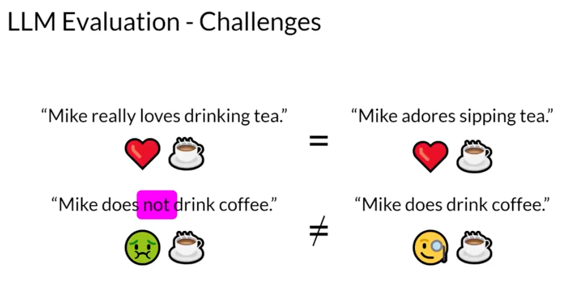
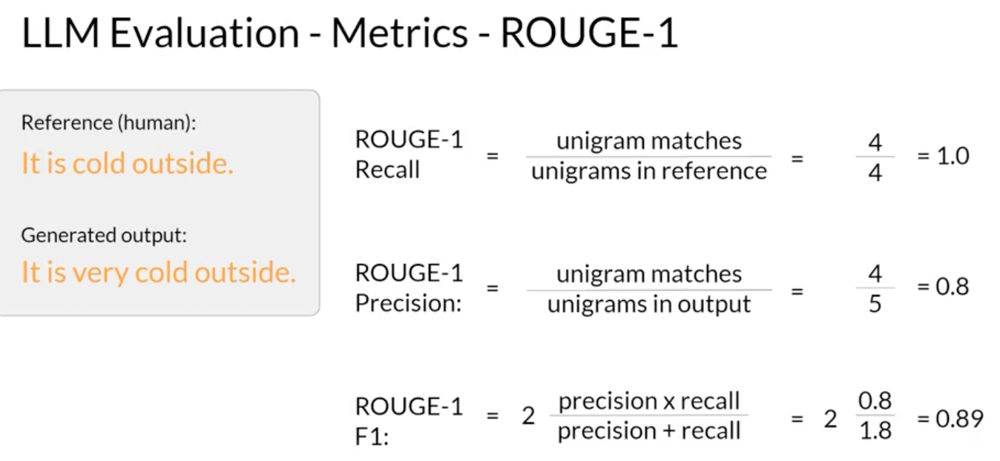
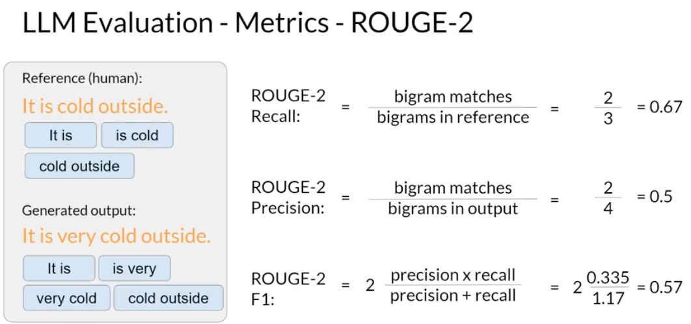
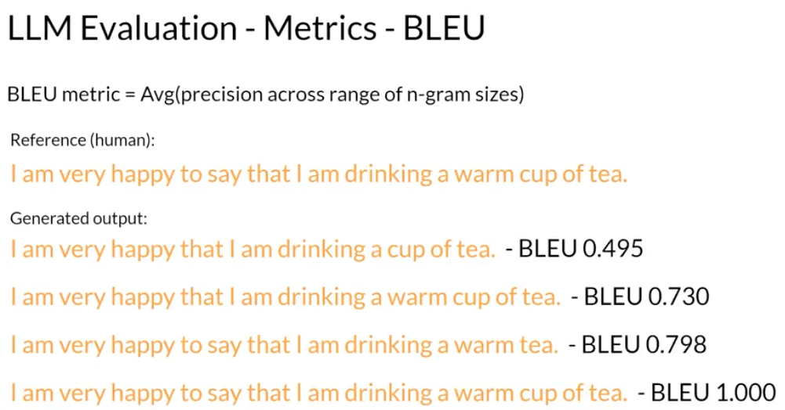
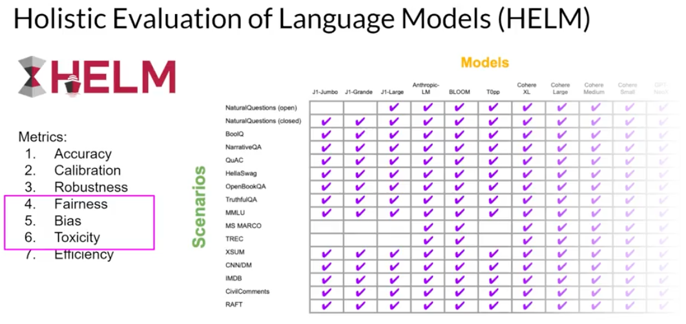

# Chapter 3 - Evaluating Summaries and Model Capabilities

[Previous: Chapter 2: Lab 1](02-lab-prompting.md) | [Contents](../../README.md) | Next: [Phase 3, Chapter 1: Fine-tuning](../03-adapt-a-model/01-fine-tuning.md)

## Define what improvement means

A fluent sentence can be wrong, and two different sentences can mean the same thing. For generated text, combine representative human review with repeatable metrics on held-out examples. Keep the test data, prompt, and decoding conditions consistent when comparing models.

## Reference-based text metrics

An **n-gram** is a sequence of $n$ tokens: unigram for one token, bigram for two. **ROUGE** compares generated summaries with one or more reference summaries:

- ROUGE-1 uses unigram overlap; ROUGE-2 uses bigrams and therefore pays more attention to nearby word order.
- ROUGE-L uses a longest common subsequence of tokens, allowing gaps while preserving order.
- Precision is matched units divided by units in the output; recall is matched units divided by units in the reference; $F_1 = 2PR/(P+R)$ when $P+R > 0$.
- Clipping prevents repeated generated words from being counted beyond their occurrences in the reference.

For reference "It is cold outside" and output "It is very cold outside", four of the reference's four unigrams match, and four of five output unigrams match: recall $=1$, precision $=0.8$, $F_1 \approx 0.89$. Replacing *very* with *not* can yield the same unigram counts but reverse meaning. Inspect semantics, not just the number.

Clipping is important when a generated summary repeats a common word. If the reference contains *cold* once but the output says *cold cold cold cold*, the extra occurrences cannot all count as matches. Without clipping, repetition would inflate overlap scores; with clipping, the score reflects only the maximum count supported by the reference. Evaluate many representative examples rather than inferring model quality from one unusually good or bad output.

**BLEU** is often used for translation: it combines modified n-gram precision over several n-gram orders and a brevity penalty. It is not simply the arithmetic average of precision scores. Both BLEU and ROUGE depend on reference wording; neither proves factual correctness.

## Broader benchmarks

GLUE and SuperGLUE test multiple language-understanding tasks. MMLU samples academic subjects; BIG-bench samples a broad variety of tasks. HELM compares models across scenarios and several metrics, including accuracy, calibration, robustness, fairness, bias, toxicity, and efficiency. A leaderboard does not replace testing your actual use case; confirm the dataset, evaluation protocol, and possible training-data contamination before comparing scores.

**Checkpoint:** What could ROUGE fail to detect in a summary that gets names right but reverses a decision? Which additional evaluation examples would you add before fine-tuning?

Sources: [text metrics lecture](../../lecture-transcripts/rouge-and-bleu-evaluation.md), [benchmark lecture](../../lecture-transcripts/evaluation-benchmarks.md); [Week 2 slides](../../slides/Week2.pdf). Scores and benchmark tables from course slides may be out of date.