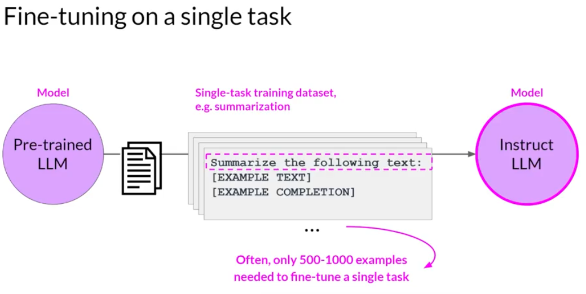

# Chapter 1 - Instruction and Parameter-efficient Fine-tuning

[Previous: Phase 2, Chapter 3: Evaluation](../02-prompt-and-evaluate/03-evaluation.md) | [Contents](../../README.md) | Next: [Chapter 2: Lab 2](02-lab-fine-tuning.md)

## When prompting is not enough

Pre-training produces a general model. Instruction tuning exposes it to task instructions paired with desired responses; task-specific fine-tuning provides examples for a particular goal. Prompting supplies examples at inference time without changing weights. Fine-tuning **updates** weights, so it needs training data and validation on unseen inputs.

For dialogue summarization, training pairs are dialogues and reference summaries. If a specific summary style or required fields cannot be obtained consistently by prompting, fine-tuning may help. First verify that failures are not caused by missing input context or a bad evaluation criterion.

## Full fine-tuning versus PEFT

| Method | Trained parameters | Strength | Trade-off |
| --- | --- | --- | --- |
| Full fine-tuning | All model weights | Maximum adaptation flexibility | More compute and memory; full model checkpoint per task |
| LoRA (a PEFT method) | Small low-rank updates; base model remains frozen | Smaller trainable state and task adapter | Adapter depends on the base model; may not match full tuning on every task |

Full training on only one task can cause **catastrophic forgetting**, degrading performance on unrelated tasks. Multitask instruction tuning mixes examples from several tasks to help retain wider capabilities, but requires suitable data and evaluation across tasks. PEFT can reduce the scope of model changes; it does not guarantee immunity from forgetting or eliminate inference cost.

Forgetting is not automatically a failure: if the deployed system only needs one specialized task, sacrificing unrelated abilities may be an acceptable trade-off. If the model must remain general, mix tasks and test them after tuning. Large instruction-tuning efforts illustrate the data scale involved; FLAN-T5 used hundreds of datasets across many task categories, rather than relying on a handful of examples.

In the dialogue-summary setting, a base model may produce a fluent summary that invents a hotel or city and omits participant names. Task tuning can improve faithfulness and preserve the names, but this must be measured on held-out dialogues rather than assumed from one example. LoRA rank also remains a quality-versus-parameter trade-off: lower rank is cheaper, but the best rank depends on the task and model.

**Checkpoint:** Which technique would you choose for three specialized summarization styles on the same base model? What would you test besides task-specific ROUGE before deploying it?

Sources: [instruction tuning introduction](../../lecture-transcripts/instruction-tuning-introduction.md), [single-task tuning](../../lecture-transcripts/single-task-tuning-and-forgetting.md), [multitask tuning](../../lecture-transcripts/multitask-fine-tuning.md), [PEFT](../../lecture-transcripts/parameter-efficient-fine-tuning.md), [LoRA](../../lecture-transcripts/lora.md), [prompt tuning](../../lecture-transcripts/prompt-tuning.md); [Week 2 slides](../../slides/Week2.pdf).