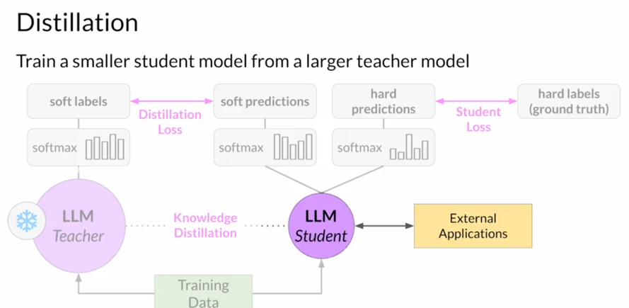

# Chapter 1 - Optimize a Model for Serving

[Previous: Phase 4, Chapter 2: Lab 3](../../04-align-behavior/02-lab-rlhf/README.md) | [Contents](../../../README.md) | Next: [Chapter 2: Applications](../02-applications/README.md)

## Pick an optimization for the constraint

Serving has different constraints from training: response latency, memory, throughput, cost, and acceptable loss of quality. Measure a baseline first. These techniques change different things:

| Technique | What changes | What to verify |
| --- | --- | --- |
| Distillation | Train a smaller student to imitate a teacher's outputs or probability distribution | Task quality, transfer to hard examples, serving cost |
| Post-training quantization | Store or compute with lower-precision weights, sometimes activations | Accuracy, calibration requirements, hardware support, latency |
| Pruning | Remove or zero low-impact parameters/connections | Actual speed/memory gains on the target hardware and quality |

Post-training quantization may require representative data to calibrate activation ranges. Low precision often saves memory, but its exact speed benefit varies by hardware, kernels, and model architecture. Pruning only yields practical speedups when the runtime exploits the resulting sparsity or smaller structure. Distillation is not limited to encoder models and can produce a different, smaller model.

Distillation can train on hard targets, such as the correct class, or on the teacher's **soft targets**. Raising the distillation temperature makes the teacher distribution less peaked, exposing relative preferences among plausible tokens; the student can learn more than a one-hot answer. The temperature must be chosen with the task in mind, and generative decoder models may retain less redundant information than encoder models, making distillation behavior architecture-dependent. Pruning also has a practical limit: if only a small fraction of weights are near zero, removing them may produce little measurable speed or memory benefit.

For training a model too large for one GPU, revisit [distributed and sharded training](../../01-understand-and-select/03-pretraining-compute/README.md); it solves a different problem from post-training inference optimization. Compare model quality, cost, and latency together after any optimization.

**Checkpoint:** Would quantization alone solve missing facts in a summary? Would FSDP alone make an already-trained model faster to serve? Explain which problem each tool actually addresses.

Sources: [deployment optimization lecture](transcripts/optimization-and-post-training-quantization.md), [lifecycle effort](transcripts/time-and-effort-across-the-lifecycle.md); [Week 3 slides](../../../slides/Week3.pdf).